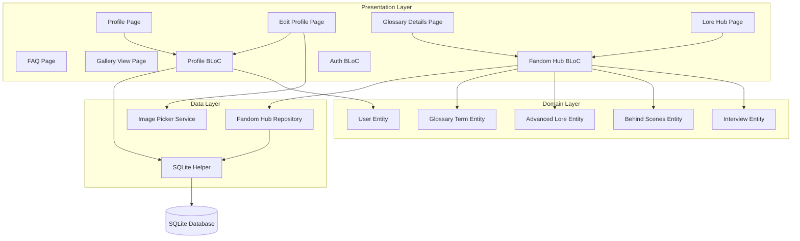
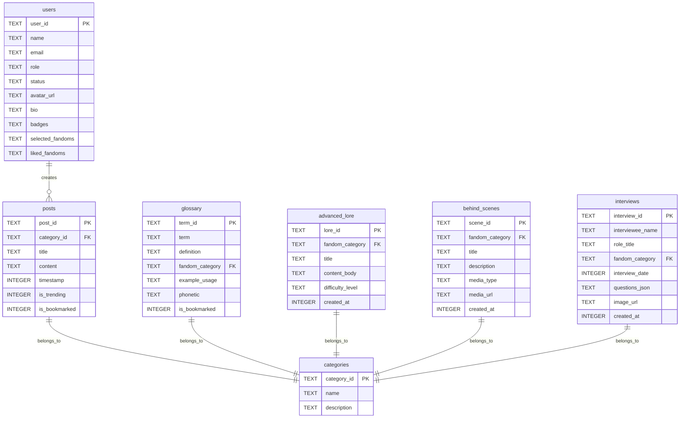

# Design Document: Profile and Lore Enhancements

## Overview

This design document specifies the technical approach for implementing 14 requirements that enhance the Fandom Verse Flutter application's Profile and Lore Hub features. The enhancements span profile personalization (picture upload, bio persistence, fandom preferences), content filtering, knowledge exploration (FAQ, glossary details, advanced lore, behind-the-scenes content, interviews), navigation fixes (media gallery), UI improvements (trivia results, skeleton loaders), and data serialization correctness.

### Design Goals

1. **Personalization**: Enable fans to customize profiles with pictures, bios, and fandom preferences
2. **Content Discovery**: Filter posts by user preferences for relevant content display
3. **Knowledge Depth**: Expand lore hub with advanced content types (lore articles, BTS, interviews)
4. **Navigation Reliability**: Fix routing issues in media gallery
5. **UI Clarity**: Display proper loading states and trivia feedback
6. **Data Integrity**: Ensure correct serialization for offline-first persistence

### Technology Stack

- **Framework**: Flutter 3.x with Dart
- **State Management**: BLoC pattern with flutter_bloc
- **Database**: SQLite via sqflite package
- **Image Selection**: image_picker package
- **Architecture**: Clean Architecture (Domain → Data → Presentation layers)

## Architecture

### High-Level Component Architecture



### Data Flow

1. **Profile Picture Upload Flow**:
   - User taps camera icon → Bottom sheet displays
   - User selects source (Gallery/Camera) → image_picker opens
   - Image selected → Preview displays immediately
   - User saves → ProfileBloc receives UpdateProfileDetailsEvent
   - ProfileBloc updates users table avatar_url → LoadUserProfileEvent refreshes state
   - UI displays uploaded image

2. **Content Filtering Flow**:
   - User has selected_fandoms in UserEntity
   - Home feed queries posts WHERE category_id IN (selected_fandoms)
   - User updates preferences → Feed re-queries with new filter
   - Empty results → Display empty state with action prompt

3. **Glossary Details Navigation Flow**:
   - User taps glossary term card → Navigator pushes GlossaryDetailsPage
   - Page displays term, phonetic, definition, category, example
   - User taps bookmark → FandomHubBloc updates is_bookmarked in database
   - Related terms query: SELECT * FROM glossary WHERE fandom_category = ? LIMIT 5
   - User taps related term → Navigate to new GlossaryDetailsPage

4. **Advanced Content Loading Flow**:
   - User scrolls to Advanced Lore section → FandomHubBloc loads data
   - Skeleton loaders display during fetch
   - Data arrives → Expandable cards render with difficulty badges
   - Similar flow for Behind the Scenes and Interviews sections

## Components and Interfaces

### 1. Profile Picture Upload Component

**Location**: `lib/features/profile/presentation/widgets/profile_picture_picker.dart`

**Interface**:
```dart
class ProfilePicturePicker extends StatelessWidget {
  final String? currentAvatarUrl;
  final Function(String imagePath) onImageSelected;
  final VoidCallback? onRemoveImage;
  
  const ProfilePicturePicker({
    this.currentAvatarUrl,
    required this.onImageSelected,
    this.onRemoveImage,
  });
}
```

**Responsibilities**:
- Display current profile picture or name initial in colored circle
- Show camera icon overlay button
- Display bottom sheet with Gallery/Camera options
- Handle image_picker integration
- Show instant preview of selected image
- Handle error states (permission denied, selection cancelled)

**Dependencies**:
- `image_picker: ^1.0.0` package
- Platform permissions (camera, photo library)

### 2. Bio Field Component

**Location**: Integrated into `lib/features/profile/presentation/pages/edit_profile_page.dart`

**Interface**:
```dart
TextFormField(
  controller: _bioController,
  maxLines: 4,
  maxLength: 200,
  decoration: InputDecoration(
    labelText: 'Bio',
    hintText: 'Tell others about yourself...',
  ),
  validator: (value) => null, // Optional field
)
```

**Fix Strategy**:
- Ensure TextEditingController is initialized from UserEntity.bio
- On save, pass bio text to UpdateProfileDetailsEvent
- Verify ProfileBloc updates bio column (not stored in wrong field)
- Ensure fromMap in UserEntity correctly parses bio field

### 3. Fandom Like Button Component

**Location**: `lib/features/fandom_hub/presentation/widgets/fandom_card.dart`

**Interface**:
```dart
class FandomLikeButton extends StatelessWidget {
  final String categoryId;
  final bool isLiked;
  final VoidCallback onToggle;
  
  const FandomLikeButton({
    required this.categoryId,
    required this.isLiked,
    required this.onToggle,
  });
}
```

**Visual States**:
- Liked: Filled heart icon (Icons.favorite) in AppColors.comicRed
- Unliked: Outlined heart icon (Icons.favorite_border) in AppColors.comicGray

**State Management**:
- ProfileBloc maintains liked_fandoms as List<String> in UserEntity
- On toggle: ProfileBloc updates users.liked_fandoms JSON column
- Profile page displays "Liked Fandoms" section with category names

### 4. Content Filter Chip Component

**Location**: `lib/features/community/presentation/widgets/filter_badge_chip.dart`

**Interface**:
```dart
class FilterBadgeChip extends StatelessWidget {
  final List<String> activePreferences;
  final VoidCallback onTap;
  
  const FilterBadgeChip({
    required this.activePreferences,
    required this.onTap,
  });
}
```

**Display Logic**:
- If preferences.isEmpty: Hide chip
- If preferences.isNotEmpty: Show "Showing posts from: ${preferences.join(', ')}"
- Tappable → Navigate to interest selection page

### 5. FAQ Expansion List Component

**Location**: `lib/features/profile/presentation/pages/faq_page.dart`

**Interface**:
```dart
class FAQPage extends StatefulWidget {
  const FAQPage({Key? key}) : super(key: key);
}

class _FAQPageState extends State<FAQPage> {
  final List<FAQEntry> _faqEntries = [...];
  String _searchQuery = '';
  
  List<FAQEntry> get filteredFAQs => _faqEntries
      .where((faq) => 
        faq.question.toLowerCase().contains(_searchQuery.toLowerCase()) ||
        faq.answer.toLowerCase().contains(_searchQuery.toLowerCase())
      )
      .toList();
}

class FAQEntry {
  final String question;
  final String answer;
  const FAQEntry(this.question, this.answer);
}
```

**UI Structure**:
- AppBar with search field
- ListView of ExpansionTile widgets
- Each tile: question as title, answer as children
- Search filters in real-time (case-insensitive)

**Static FAQ Data** (8 entries from requirements):
1. How do I personalize my profile?
2. How does content filtering work?
3. Can I use the app offline?
4. How do I bookmark content?
5. How do I report inappropriate content?
6. How do I purchase merchandise?
7. How do I RSVP to conventions?
8. I found a bug. Where do I report it?

### 6. Glossary Details Page Component

**Location**: `lib/features/fandom_hub/presentation/pages/glossary_details_page.dart`

**Interface**:
```dart
class GlossaryDetailsPage extends StatelessWidget {
  final GlossaryTerm term;
  
  const GlossaryDetailsPage({required this.term});
}
```

**Layout Sections**:
1. **AppBar**: Back button + term name + share button
2. **Hero Section**: Large term display with phonetic pronunciation
3. **Definition Card**: Formatted definition text in glass container
4. **Category Badge**: Fandom category with category-specific color
5. **Example Usage Card**: Example sentence with term highlighted
6. **Bookmark Button**: FAB with toggle functionality
7. **Related Terms Section**: Horizontal scrollable list of 3-5 related terms

**Navigation**:
- Receives term via constructor parameter from previous page
- Tapping related term → Navigator.push new GlossaryDetailsPage
- Share button → Share.share('${term.term}: ${term.definition}')

### 7. Media Gallery Route Fix

**File**: `lib/core/routing/app_router.dart`

**Missing Route Registration**:
```dart
static const String galleryView = '/gallery-view';

static Route<dynamic> generateRoute(RouteSettings settings) {
  switch (settings.name) {
    // ... existing routes
    case galleryView:
      final args = settings.arguments as GalleryItem;
      return MaterialPageRoute(
        builder: (_) => GalleryViewPage(item: args),
      );
    // ... other routes
  }
}
```

**Gallery View Page**:
```dart
class GalleryViewPage extends StatelessWidget {
  final GalleryItem item;
  
  const GalleryViewPage({required this.item});
  
  @override
  Widget build(BuildContext context) {
    return Scaffold(
      appBar: AppBar(title: Text(item.title)),
      body: Column(
        children: [
          Expanded(
            child: InteractiveViewer(
              child: Image.network(item.imageUrl),
            ),
          ),
          _ArtistInfoSection(
            artistName: item.artistName,
            likeCount: item.likeCount,
          ),
        ],
      ),
    );
  }
}
```

### 8. Trivia Results Display Component

**Location**: `lib/features/fandom_hub/presentation/widgets/trivia_question_card.dart`

**State Management**:
```dart
class TriviaQuestionCard extends StatefulWidget {
  final TriviaQuestion question;
  final Function(int selectedIndex) onAnswerSelected;
  
  const TriviaQuestionCard({
    required this.question,
    required this.onAnswerSelected,
  });
}

class _TriviaQuestionCardState extends State<TriviaQuestionCard> {
  int? _selectedIndex;
  bool _showResults = false;
  
  Color _getOptionColor(int index) {
    if (!_showResults) return Colors.transparent;
    if (index == widget.question.correctAnswerIndex) {
      return AppColors.success.withOpacity(0.15);
    }
    if (index == _selectedIndex && index != widget.question.correctAnswerIndex) {
      return AppColors.error.withOpacity(0.15);
    }
    return Colors.transparent;
  }
}
```

**Visual States**:
- **Before Answer**: All options have neutral border
- **After Answer (Correct)**: Selected option has green background + border
- **After Answer (Incorrect)**: Selected has red background, correct has green background
- **Explanation Display**: Glass container below options with explanation text
- **Score Display**: Container with AppColors.darkAccentGold background showing "Score: X / Y"

### 9. Advanced Lore Expandable Card

**Location**: `lib/features/fandom_hub/presentation/widgets/advanced_lore_card.dart`

**Interface**:
```dart
class AdvancedLoreCard extends StatefulWidget {
  final AdvancedLoreEntity lore;
  
  const AdvancedLoreCard({required this.lore});
}
```

**UI Structure**:
- Collapsed: Title + Difficulty Badge (colored)
- Expanded: Title + Difficulty Badge + Full content_body
- Difficulty Colors:
  - "Beginner": AppColors.success (green)
  - "Intermediate": AppColors.warning (orange)
  - "Expert": AppColors.error (red)

### 10. Behind the Scenes Card

**Location**: `lib/features/fandom_hub/presentation/widgets/behind_scenes_card.dart`

**Interface**:
```dart
class BehindScenesCard extends StatelessWidget {
  final BehindScenesEntity scene;
  final VoidCallback onTap;
  
  const BehindScenesCard({
    required this.scene,
    required this.onTap,
  });
}
```

**Card Layout**:
- Thumbnail image (network image with cached_network_image)
- Title overlay
- Media type icon badge (video/image/article)
- Tap → Navigate to detail page with full description and media

### 11. Interview Card

**Location**: `lib/features/fandom_hub/presentation/widgets/interview_card.dart`

**Interface**:
```dart
class InterviewCard extends StatelessWidget {
  final InterviewEntity interview;
  final VoidCallback onTap;
  
  const InterviewCard({
    required this.interview,
    required this.onTap,
  });
}
```

**Card Layout**:
- Circular avatar image
- Interviewee name
- Role/title subtitle
- Tap → Navigate to interview detail page

**Interview Detail Page**:
- Hero image at top
- Name, role, date header
- Q&A pairs parsed from questions_json
- Formatted layout with alternating background colors for questions/answers

### 12. Skeleton Loader Component

**Location**: `lib/core/widgets/skeleton_loader.dart` (already exists)

**Usage Pattern**:
```dart
// Glossary Tab Loading
if (state is! FandomHubLoaded) {
  return GridView.builder(
    itemCount: 6,
    itemBuilder: (context, index) => SkeletonLoader(
      height: 80,
      borderRadius: 12,
    ),
  );
}

// Media Tab Loading
if (state is! FandomHubLoaded) {
  return GridView.builder(
    gridDelegate: SliverGridDelegateWithFixedCrossAxisCount(
      crossAxisCount: 2,
      childAspectRatio: 0.85,
    ),
    itemCount: 6,
    itemBuilder: (context, index) => SkeletonLoader(),
  );
}
```

**Animation**: Shimmer effect using existing SkeletonLoader widget implementation

## Data Models

### 1. User Entity Enhancement

**File**: `lib/features/auth/domain/entities/user_entity.dart`

**New Field**:
```dart
class UserEntity {
  // ... existing fields
  final List<String> likedFandoms; // NEW: for Requirement 3
  
  const UserEntity({
    // ... existing parameters
    this.likedFandoms = const [],
  });
}
```

**Serialization Fix** (Requirement 13):
```dart
Map<String, dynamic> toMap() {
  return {
    'user_id': id,
    'name': name,
    'email': email,
    'role': role,
    'status': status,
    'avatar_url': avatarUrl,
    'bio': bio, // Ensure bio is included
    'badges': jsonEncode(badges),
    'selected_fandoms': jsonEncode(selectedFandoms),
    'liked_fandoms': jsonEncode(likedFandoms), // NEW
  };
}

factory UserEntity.fromMap(Map<String, dynamic> map) {
  List<String> parseList(dynamic value) {
    if (value == null) return [];
    if (value is List) return value.map((e) => e.toString()).toList();
    if (value is String && value.isNotEmpty) {
      try {
        final decoded = jsonDecode(value);
        if (decoded is List) return decoded.map((e) => e.toString()).toList();
      } catch (_) {
        return [value];
      }
    }
    return [];
  }
  
  return UserEntity(
    id: (map['user_id'] ?? map['id'] ?? '').toString(),
    name: (map['name'] ?? 'Fan Explorer').toString(),
    email: (map['email'] ?? '').toString(),
    role: (map['role'] ?? 'fan').toString(),
    status: (map['status'] ?? 'active').toString(),
    avatarUrl: (map['avatar_url'])?.toString(),
    bio: map['bio']?.toString() ?? '', // Explicit default
    badges: parseList(map['badges']),
    selectedFandoms: parseList(map['selected_fandoms']),
    likedFandoms: parseList(map['liked_fandoms']), // NEW
  );
}
```

### 2. Glossary Term Entity Enhancement

**File**: `lib/features/fandom_hub/domain/entities/glossary_term.dart`

**Serialization Fix** (Requirement 14):
```dart
// Already has correct structure, needs validation enhancement

factory GlossaryTerm.fromMap(Map<String, dynamic> map) {
  // Validate required fields
  if (!map.containsKey('term_id') || !map.containsKey('term')) {
    throw FormatException('Missing required fields: term_id or term');
  }
  
  try {
    return GlossaryTerm(
      id: (map['term_id']).toString(),
      term: (map['term']).toString(),
      definition: (map['definition'] ?? '').toString(),
      fandomCategory: (map['fandom_category'] ?? '').toString(),
      exampleUsage: (map['example_usage'] ?? '').toString(),
      phonetic: (map['phonetic'] ?? '').toString(), // Handle null
      isBookmarked: (map['is_bookmarked'] as int? ?? 0) == 1, // Handle INTEGER conversion
    );
  } catch (e) {
    throw FormatException('Invalid field type in glossary map: ${e.toString()}');
  }
}

Map<String, dynamic> toMap() {
  return {
    'term_id': id,
    'term': term,
    'definition': definition,
    'fandom_category': fandomCategory,
    'example_usage': exampleUsage,
    'phonetic': phonetic,
    'is_bookmarked': isBookmarked ? 1 : 0, // Store as INTEGER
  };
}
```

### 3. Advanced Lore Entity

**File**: `lib/features/fandom_hub/domain/entities/advanced_lore_entity.dart`

**New Entity**:
```dart
import 'package:equatable/equatable.dart';

class AdvancedLoreEntity extends Equatable {
  final String id;
  final String fandomCategory;
  final String title;
  final String contentBody;
  final String difficultyLevel; // "Beginner", "Intermediate", "Expert"
  final int createdAt;
  
  const AdvancedLoreEntity({
    required this.id,
    required this.fandomCategory,
    required this.title,
    required this.contentBody,
    this.difficultyLevel = 'Intermediate',
    required this.createdAt,
  });
  
  factory AdvancedLoreEntity.fromDbMap(Map<String, dynamic> map) {
    return AdvancedLoreEntity(
      id: map['lore_id'].toString(),
      fandomCategory: map['fandom_category'].toString(),
      title: map['title'].toString(),
      contentBody: map['content_body'].toString(),
      difficultyLevel: map['difficulty_level']?.toString() ?? 'Intermediate',
      createdAt: map['created_at'] as int,
    );
  }
  
  Map<String, dynamic> toDbMap() {
    return {
      'lore_id': id,
      'fandom_category': fandomCategory,
      'title': title,
      'content_body': contentBody,
      'difficulty_level': difficultyLevel,
      'created_at': createdAt,
    };
  }
  
  @override
  List<Object?> get props => [id, fandomCategory, title, contentBody, difficultyLevel, createdAt];
}
```

### 4. Behind Scenes Entity

**File**: `lib/features/fandom_hub/domain/entities/behind_scenes_entity.dart`

**New Entity**:
```dart
import 'package:equatable/equatable.dart';

class BehindScenesEntity extends Equatable {
  final String id;
  final String fandomCategory;
  final String title;
  final String description;
  final String mediaType; // "video", "image", "article"
  final String? mediaUrl;
  final int createdAt;
  
  const BehindScenesEntity({
    required this.id,
    required this.fandomCategory,
    required this.title,
    required this.description,
    required this.mediaType,
    this.mediaUrl,
    required this.createdAt,
  });
  
  factory BehindScenesEntity.fromDbMap(Map<String, dynamic> map) {
    return BehindScenesEntity(
      id: map['scene_id'].toString(),
      fandomCategory: map['fandom_category'].toString(),
      title: map['title'].toString(),
      description: map['description'].toString(),
      mediaType: map['media_type'].toString(),
      mediaUrl: map['media_url']?.toString(),
      createdAt: map['created_at'] as int,
    );
  }
  
  Map<String, dynamic> toDbMap() {
    return {
      'scene_id': id,
      'fandom_category': fandomCategory,
      'title': title,
      'description': description,
      'media_type': mediaType,
      'media_url': mediaUrl,
      'created_at': createdAt,
    };
  }
  
  @override
  List<Object?> get props => [id, fandomCategory, title, description, mediaType, mediaUrl, createdAt];
}
```

### 5. Interview Entity

**File**: `lib/features/fandom_hub/domain/entities/interview_entity.dart`

**New Entity**:
```dart
import 'dart:convert';
import 'package:equatable/equatable.dart';

class InterviewEntity extends Equatable {
  final String id;
  final String intervieweeName;
  final String roleTitle;
  final String fandomCategory;
  final int interviewDate;
  final List<QuestionAnswer> questions;
  final String? imageUrl;
  final int createdAt;
  
  const InterviewEntity({
    required this.id,
    required this.intervieweeName,
    required this.roleTitle,
    required this.fandomCategory,
    required this.interviewDate,
    required this.questions,
    this.imageUrl,
    required this.createdAt,
  });
  
  factory InterviewEntity.fromDbMap(Map<String, dynamic> map) {
    final questionsJson = map['questions_json'] as String;
    final List<dynamic> questionsData = jsonDecode(questionsJson);
    final questions = questionsData
        .map((q) => QuestionAnswer(
              question: q['question'].toString(),
              answer: q['answer'].toString(),
            ))
        .toList();
    
    return InterviewEntity(
      id: map['interview_id'].toString(),
      intervieweeName: map['interviewee_name'].toString(),
      roleTitle: map['role_title'].toString(),
      fandomCategory: map['fandom_category'].toString(),
      interviewDate: map['interview_date'] as int,
      questions: questions,
      imageUrl: map['image_url']?.toString(),
      createdAt: map['created_at'] as int,
    );
  }
  
  Map<String, dynamic> toDbMap() {
    final questionsJson = jsonEncode(
      questions.map((q) => {'question': q.question, 'answer': q.answer}).toList(),
    );
    
    return {
      'interview_id': id,
      'interviewee_name': intervieweeName,
      'role_title': roleTitle,
      'fandom_category': fandomCategory,
      'interview_date': interviewDate,
      'questions_json': questionsJson,
      'image_url': imageUrl,
      'created_at': createdAt,
    };
  }
  
  @override
  List<Object?> get props => [id, intervieweeName, roleTitle, fandomCategory, interviewDate, questions, imageUrl, createdAt];
}

class QuestionAnswer extends Equatable {
  final String question;
  final String answer;
  
  const QuestionAnswer({required this.question, required this.answer});
  
  @override
  List<Object?> get props => [question, answer];
}
```

## Database Schema Updates

### 1. Users Table Modifications

**File**: `lib/core/database/database_tables.dart`

**Column Addition**:
```sql
ALTER TABLE users ADD COLUMN liked_fandoms TEXT DEFAULT '[]';
```

**Implementation in SqliteHelper**:
```dart
// In _onUpgrade method
await _safeAddColumn(db, DbConstants.tableUsers, 'liked_fandoms', "TEXT DEFAULT '[]'");
```

### 2. New Table: Advanced Lore

```sql
CREATE TABLE IF NOT EXISTS advanced_lore (
    lore_id TEXT PRIMARY KEY,
    fandom_category TEXT NOT NULL,
    title TEXT NOT NULL,
    content_body TEXT NOT NULL,
    difficulty_level TEXT DEFAULT 'Intermediate',
    created_at INTEGER NOT NULL
);

CREATE INDEX IF NOT EXISTS idx_advanced_lore_category 
ON advanced_lore(fandom_category);
```

**Implementation**:
```dart
// In database_tables.dart
static const String createAdvancedLoreTable = '''
  CREATE TABLE IF NOT EXISTS advanced_lore (
    lore_id TEXT PRIMARY KEY,
    fandom_category TEXT NOT NULL,
    title TEXT NOT NULL,
    content_body TEXT NOT NULL,
    difficulty_level TEXT DEFAULT 'Intermediate',
    created_at INTEGER NOT NULL
  )
''';

// Add to allCreateStatements list
static final List<String> allCreateStatements = [
  // ... existing tables
  createAdvancedLoreTable,
  createBehindScenesTable,
  createInterviewsTable,
];
```

### 3. New Table: Behind Scenes

```sql
CREATE TABLE IF NOT EXISTS behind_scenes (
    scene_id TEXT PRIMARY KEY,
    fandom_category TEXT NOT NULL,
    title TEXT NOT NULL,
    description TEXT NOT NULL,
    media_type TEXT NOT NULL,
    media_url TEXT,
    created_at INTEGER NOT NULL
);

CREATE INDEX IF NOT EXISTS idx_behind_scenes_category 
ON behind_scenes(fandom_category);
```

### 4. New Table: Interviews

```sql
CREATE TABLE IF NOT EXISTS interviews (
    interview_id TEXT PRIMARY KEY,
    interviewee_name TEXT NOT NULL,
    role_title TEXT NOT NULL,
    fandom_category TEXT NOT NULL,
    interview_date INTEGER NOT NULL,
    questions_json TEXT NOT NULL,
    image_url TEXT,
    created_at INTEGER NOT NULL
);

CREATE INDEX IF NOT EXISTS idx_interviews_category 
ON interviews(fandom_category);
```

### Database Schema Diagram



## BLoC State Management

### 1. Profile BLoC Enhancements

**File**: `lib/features/profile/presentation/bloc/profile_bloc.dart`

**New Events**:
```dart
// profile_event.dart

class UpdateAvatarEvent extends ProfileEvent {
  final String userId;
  final String imagePath;
  
  const UpdateAvatarEvent({required this.userId, required this.imagePath});
}

class ToggleLikeFandomEvent extends ProfileEvent {
  final String userId;
  final String categoryId;
  
  const ToggleLikeFandomEvent({required this.userId, required this.categoryId});
}

class LoadLikedFandomsEvent extends ProfileEvent {
  final String userId;
  
  const LoadLikedFandomsEvent({required this.userId});
}
```

**Event Handlers**:
```dart
// In ProfileBloc

on<UpdateAvatarEvent>(_onUpdateAvatar);
on<ToggleLikeFandomEvent>(_onToggleLikeFandom);

Future<void> _onUpdateAvatar(
  UpdateAvatarEvent event,
  Emitter<ProfileState> emit,
) async {
  try {
    await _dbHelper.update(DbConstants.tableUsers, 'user_id', event.userId, {
      'avatar_url': event.imagePath,
    });
    add(LoadUserProfileEvent(userId: event.userId));
  } catch (e) {
    emit(ProfileError('Failed to update avatar: ${e.toString()}'));
  }
}

Future<void> _onToggleLikeFandom(
  ToggleLikeFandomEvent event,
  Emitter<ProfileState> emit,
) async {
  if (state is ProfileLoaded) {
    final current = state as ProfileLoaded;
    final userEntity = UserEntity.fromMap(current.user);
    
    List<String> likedFandoms = List.from(userEntity.likedFandoms);
    
    if (likedFandoms.contains(event.categoryId)) {
      likedFandoms.remove(event.categoryId);
    } else {
      likedFandoms.add(event.categoryId);
    }
    
    await _dbHelper.update(DbConstants.tableUsers, 'user_id', event.userId, {
      'liked_fandoms': jsonEncode(likedFandoms),
    });
    
    add(LoadUserProfileEvent(userId: event.userId));
  }
}
```

**State Enhancement**:
```dart
// profile_state.dart

class ProfileLoaded extends ProfileState {
  final Map<String, dynamic> user;
  final List<Map<String, dynamic>> orders;
  final int bookmarksCount;
  final int wishlistCount;
  final int discussionCount;
  final int offlinePostsCount;
  final int offlineEventsCount;
  final int offlineGlossaryCount;
  final double cacheSizeMB;
  final String? statusMessage;
  final List<String> likedFandoms; // NEW
  
  const ProfileLoaded({
    required this.user,
    required this.orders,
    required this.bookmarksCount,
    required this.wishlistCount,
    required this.discussionCount,
    required this.offlinePostsCount,
    required this.offlineEventsCount,
    required this.offlineGlossaryCount,
    required this.cacheSizeMB,
    this.statusMessage,
    this.likedFandoms = const [],
  });
}
```

### 2. Fandom Hub BLoC Enhancements

**File**: `lib/features/fandom_hub/presentation/bloc/fandom_hub_bloc.dart`

**New Events**:
```dart
// fandom_hub_event.dart

class LoadAdvancedLoreEvent extends FandomHubEvent {
  final String? categoryFilter;
  
  const LoadAdvancedLoreEvent({this.categoryFilter});
}

class LoadBehindScenesEvent extends FandomHubEvent {
  final String? categoryFilter;
  
  const LoadBehindScenesEvent({this.categoryFilter});
}

class LoadInterviewsEvent extends FandomHubEvent {
  final String? categoryFilter;
  
  const LoadInterviewsEvent({this.categoryFilter});
}
```

**State Enhancement**:
```dart
// fandom_hub_state.dart

class FandomHubLoaded extends FandomHubState {
  final List<dynamic> trendingPosts;
  final List<dynamic> latestNews;
  final List<GlossaryTerm> glossary;
  final String? activeCategory;
  final String? searchQuery;
  final List<AdvancedLoreEntity> advancedLore; // NEW
  final List<BehindScenesEntity> behindScenes; // NEW
  final List<InterviewEntity> interviews; // NEW
  
  const FandomHubLoaded({
    required this.trendingPosts,
    required this.latestNews,
    required this.glossary,
    this.activeCategory,
    this.searchQuery,
    this.advancedLore = const [],
    this.behindScenes = const [],
    this.interviews = const [],
  });
  
  FandomHubLoaded copyWith({
    List<dynamic>? trendingPosts,
    List<dynamic>? latestNews,
    List<GlossaryTerm>? glossary,
    String? activeCategory,
    String? searchQuery,
    List<AdvancedLoreEntity>? advancedLore,
    List<BehindScenesEntity>? behindScenes,
    List<InterviewEntity>? interviews,
  }) {
    return FandomHubLoaded(
      trendingPosts: trendingPosts ?? this.trendingPosts,
      latestNews: latestNews ?? this.latestNews,
      glossary: glossary ?? this.glossary,
      activeCategory: activeCategory ?? this.activeCategory,
      searchQuery: searchQuery ?? this.searchQuery,
      advancedLore: advancedLore ?? this.advancedLore,
      behindScenes: behindScenes ?? this.behindScenes,
      interviews: interviews ?? this.interviews,
    );
  }
}
```

**Event Handlers**:
```dart
// In FandomHubBloc

on<LoadAdvancedLoreEvent>(_onLoadAdvancedLore);
on<LoadBehindScenesEvent>(_onLoadBehindScenes);
on<LoadInterviewsEvent>(_onLoadInterviews);

Future<void> _onLoadAdvancedLore(
  LoadAdvancedLoreEvent event,
  Emitter<FandomHubState> emit,
) async {
  try {
    final lore = await _repository.getAdvancedLore(categoryFilter: event.categoryFilter);
    
    if (state is FandomHubLoaded) {
      final current = state as FandomHubLoaded;
      emit(current.copyWith(advancedLore: lore));
    }
  } catch (e) {
    // Maintain current state on error
  }
}

Future<void> _onLoadBehindScenes(
  LoadBehindScenesEvent event,
  Emitter<FandomHubState> emit,
) async {
  try {
    final scenes = await _repository.getBehindScenes(categoryFilter: event.categoryFilter);
    
    if (state is FandomHubLoaded) {
      final current = state as FandomHubLoaded;
      emit(current.copyWith(behindScenes: scenes));
    }
  } catch (e) {
    // Maintain current state on error
  }
}

Future<void> _onLoadInterviews(
  LoadInterviewsEvent event,
  Emitter<FandomHubState> emit,
) async {
  try {
    final interviews = await _repository.getInterviews(categoryFilter: event.categoryFilter);
    
    if (state is FandomHubLoaded) {
      final current = state as FandomHubLoaded;
      emit(current.copyWith(interviews: interviews));
    }
  } catch (e) {
    // Maintain current state on error
  }
}
```

### 3. Repository Interface Enhancement

**File**: `lib/core/repositories/i_fandom_hub_repository.dart`

**New Methods**:
```dart
abstract class IFandomHubRepository {
  // ... existing methods
  
  Future<List<AdvancedLoreEntity>> getAdvancedLore({String? categoryFilter});
  Future<List<BehindScenesEntity>> getBehindScenes({String? categoryFilter});
  Future<List<InterviewEntity>> getInterviews({String? categoryFilter});
}
```

**Implementation**: `lib/core/repositories/fandom_hub_repository_impl.dart`

```dart
class FandomHubRepositoryImpl implements IFandomHubRepository {
  final SqliteHelper _dbHelper;
  
  FandomHubRepositoryImpl({SqliteHelper? dbHelper})
      : _dbHelper = dbHelper ?? SqliteHelper.instance;
  
  @override
  Future<List<AdvancedLoreEntity>> getAdvancedLore({String? categoryFilter}) async {
    final query = categoryFilter != null
        ? await _dbHelper.query(
            'advanced_lore',
            where: 'fandom_category = ?',
            whereArgs: [categoryFilter],
            orderBy: 'created_at DESC',
          )
        : await _dbHelper.query(
            'advanced_lore',
            orderBy: 'created_at DESC',
          );
    
    return query.map((map) => AdvancedLoreEntity.fromDbMap(map)).toList();
  }
  
  @override
  Future<List<BehindScenesEntity>> getBehindScenes({String? categoryFilter}) async {
    final query = categoryFilter != null
        ? await _dbHelper.query(
            'behind_scenes',
            where: 'fandom_category = ?',
            whereArgs: [categoryFilter],
            orderBy: 'created_at DESC',
          )
        : await _dbHelper.query(
            'behind_scenes',
            orderBy: 'created_at DESC',
          );
    
    return query.map((map) => BehindScenesEntity.fromDbMap(map)).toList();
  }
  
  @override
  Future<List<InterviewEntity>> getInterviews({String? categoryFilter}) async {
    final query = categoryFilter != null
        ? await _dbHelper.query(
            'interviews',
            where: 'fandom_category = ?',
            whereArgs: [categoryFilter],
            orderBy: 'interview_date DESC',
          )
        : await _dbHelper.query(
            'interviews',
            orderBy: 'interview_date DESC',
          );
    
    return query.map((map) => InterviewEntity.fromDbMap(map)).toList();
  }
}
```

## UI/UX Design

### Profile Picture Upload Flow

**Screen**: Edit Profile Page

**Layout**:
```
┌─────────────────────────────────┐
│  ← Edit Profile            Save │
├─────────────────────────────────┤
│                                 │
│         ┌─────────┐            │
│         │         │            │
│         │  Image  │  📷        │
│         │   or    │            │
│         │   "J"   │            │
│         └─────────┘            │
│                                 │
│  Name                          │
│  ┌───────────────────────────┐│
│  │ John Doe                  ││
│  └───────────────────────────┘│
│                                 │
│  Bio                           │
│  ┌───────────────────────────┐│
│  │ Tell others about         ││
│  │ yourself...               ││
│  │                           ││
│  └───────────────────────────┘│
│  200 characters max            │
│                                 │
└─────────────────────────────────┘
```

**Image Selection Bottom Sheet**:
```
┌─────────────────────────────────┐
│  Select Image Source            │
├─────────────────────────────────┤
│  📷  Camera                     │
├─────────────────────────────────┤
│  🖼️   Gallery                   │
├─────────────────────────────────┤
│        Cancel                   │
└─────────────────────────────────┘
```

### Fandom Like System UI

**Fandom Card with Heart Button**:
```
┌─────────────────────────┐
│  [Category Image]    ❤️ │
│                         │
│  Anime & Manga         │
│  150 posts             │
└─────────────────────────┘
```

**Profile Liked Fandoms Section**:
```
┌─────────────────────────────────┐
│  Liked Fandoms                  │
├─────────────────────────────────┤
│  • Anime & Manga               │
│  • Marvel Universe             │
│  • K-Pop                       │
│  • Gaming                      │
└─────────────────────────────────┘
```

### Content Filter Badge

**Home Feed with Filter**:
```
┌─────────────────────────────────┐
│  Fandom Verse              🔔   │
├─────────────────────────────────┤
│  Showing posts from:            │
│  [ Anime, Marvel, Gaming ]  ⚙️  │
├─────────────────────────────────┤
│  [Post 1 - Anime]              │
│  [Post 2 - Marvel]             │
│  [Post 3 - Gaming]             │
└─────────────────────────────────┘
```

### FAQ Page Layout

```
┌─────────────────────────────────┐
│  ← FAQ                          │
├─────────────────────────────────┤
│  🔍 Search FAQs...              │
├─────────────────────────────────┤
│  ▸ How do I personalize...     │
├─────────────────────────────────┤
│  ▾ How does content filtering  │
│    work?                        │
│                                 │
│    Select your favorite fandoms │
│    in the interest selection    │
│    screen...                    │
├─────────────────────────────────┤
│  ▸ Can I use the app offline?  │
├─────────────────────────────────┤
│  ▸ How do I bookmark content?  │
└─────────────────────────────────┘
```

### Glossary Details Page Layout

```
┌─────────────────────────────────┐
│  ← Nakama                   ⋮  │
├─────────────────────────────────┤
│                                 │
│  NAKAMA                        │
│  /nakama/                      │
│                                 │
│  ┌─────────────────────────┐  │
│  │ Definition              │  │
│  │ A Japanese term meaning │  │
│  │ comrade, friend...      │  │
│  └─────────────────────────┘  │
│                                 │
│  Category: Anime & Manga       │
│                                 │
│  ┌─────────────────────────┐  │
│  │ Example Usage           │  │
│  │ "Luffy values his       │  │
│  │ nakama above all else." │  │
│  └─────────────────────────┘  │
│                                 │
│  Related Terms                 │
│  ┌──────┐ ┌──────┐ ┌──────┐  │
│  │Sempai│ │Kohai │ │Sensei│  │
│  └──────┘ └──────┘ └──────┘  │
│                                 │
│                            [🔖] │
└─────────────────────────────────┘
```

### Trivia Results Display

**Before Answer**:
```
┌─────────────────────────────────┐
│  Question 1 of 5                │
│                                 │
│  What year was the first issue  │
│  of Spider-Man published?       │
│                                 │
│  ○ 1960                        │
│  ○ 1962                        │
│  ○ 1965                        │
│  ○ 1958                        │
│                                 │
└─────────────────────────────────┘
```

**After Correct Answer**:
```
┌─────────────────────────────────┐
│  Question 1 of 5                │
│                                 │
│  What year was the first issue  │
│  of Spider-Man published?       │
│                                 │
│  ○ 1960                        │
│  ✓ 1962          [GREEN BG]    │
│  ○ 1965                        │
│  ○ 1958                        │
│                                 │
│  ┌─────────────────────────┐  │
│  │ ✓ Correct!              │  │
│  │ Spider-Man first appeared│  │
│  │ in Amazing Fantasy #15...│  │
│  └─────────────────────────┘  │
│                                 │
│      [ Next Question ]         │
│                                 │
│      Score: 1 / 5 [GOLD BG]    │
└─────────────────────────────────┘
```

**After Incorrect Answer**:
```
┌─────────────────────────────────┐
│  Question 1 of 5                │
│                                 │
│  What year was the first issue  │
│  of Spider-Man published?       │
│                                 │
│  ✗ 1960          [RED BG]      │
│  ✓ 1962          [GREEN BG]    │
│  ○ 1965                        │
│  ○ 1958                        │
│                                 │
│  ┌─────────────────────────┐  │
│  │ ✗ Incorrect             │  │
│  │ Spider-Man first appeared│  │
│  │ in Amazing Fantasy #15...│  │
│  └─────────────────────────┘  │
│                                 │
│      [ Next Question ]         │
│                                 │
│      Score: 0 / 5 [GOLD BG]    │
└─────────────────────────────────┘
```

### Advanced Lore Card

**Collapsed**:
```
┌─────────────────────────────────┐
│  The Hidden Village Origins ▸   │
│  [Expert]                       │
└─────────────────────────────────┘
```

**Expanded**:
```
┌─────────────────────────────────┐
│  The Hidden Village Origins ▾   │
│  [Expert]                       │
│                                 │
│  The concept of hidden villages │
│  in Naruto was inspired by real │
│  ninja villages in feudal Japan.│
│  Each village represents a      │
│  different elemental affinity...│
│                                 │
└─────────────────────────────────┘
```

### Behind the Scenes Card

```
┌─────────────────────┐
│  [Thumbnail Image]  │
│  🎬                 │
│                     │
│  Making of Episode  │
│  127                │
└─────────────────────┘
```

### Interview Card

```
┌─────────────────────┐
│   [Avatar Image]    │
│                     │
│  Masashi Kishimoto  │
│  Creator & Author   │
└─────────────────────┘
```

### Skeleton Loader States

**Glossary Tab Loading**:
```
┌─────────────────────────────────┐
│  [████████████████░░░░░░]      │
│  [████████████░░░░░░░░░░]      │
│  [██████████████████░░░░]      │
│  [████████░░░░░░░░░░░░░░]      │
│  [██████████████░░░░░░░░]      │
│  [████████████████████░░]      │
└─────────────────────────────────┘
```

**Media Tab Loading (2-column grid)**:
```
┌─────────────────────────────────┐
│  [████████]  [████████]        │
│  [████████]  [████████]        │
│  [░░░░░░░░]  [░░░░░░░░]        │
│                                 │
│  [████████]  [████████]        │
│  [████████]  [████████]        │
│  [░░░░░░░░]  [░░░░░░░░]        │
└─────────────────────────────────┘
```

## Error Handling

### Image Picker Error Scenarios

1. **Permission Denied**:
   - User denies camera/gallery permission
   - Display snackbar: "Permission denied. Please enable in settings."
   - Action: "Open Settings" button → Navigate to app settings

2. **Selection Cancelled**:
   - User closes picker without selecting
   - Display snackbar: "Image selection cancelled"
   - Maintain existing avatar state

3. **Invalid Image Format**:
   - Selected file is not a valid image
   - Display snackbar: "Invalid image format. Please select a JPG, PNG, or HEIC file."

4. **File Too Large**:
   - Image exceeds 10MB
   - Display snackbar: "Image too large. Please select an image under 10MB."

### Database Operation Errors

1. **Bio Update Failure**:
   - SQLite write fails
   - Display snackbar: "Failed to save bio. Please try again."
   - Maintain previous bio value in UI

2. **Liked Fandoms Sync Failure**:
   - JSON serialization fails or DB write fails
   - Revert UI state (unlike the fandom)
   - Display snackbar: "Failed to update preferences. Please try again."

3. **Content Load Failure**:
   - Query returns empty or throws exception
   - Display empty state with retry button
   - "Unable to load content. Please try again."

### Navigation Errors

1. **Gallery View Route Missing**:
   - Route not registered in app_router.dart
   - Catch exception in onTap handler
   - Display snackbar: "Unable to open gallery. Please update the app."
   - Log error for debugging

2. **Glossary Details Navigation Failure**:
   - Term data incomplete or missing
   - Display snackbar: "Unable to load term details."
   - Remain on glossary list page

### Content Display Errors

1. **Empty Advanced Lore**:
   - No records in advanced_lore table
   - Display: "Advanced lore content coming soon!"
   - No skeleton loaders, no error state

2. **Empty Behind the Scenes**:
   - No records in behind_scenes table
   - Display: "Behind the scenes content coming soon!"

3. **Empty Interviews**:
   - No records in interviews table
   - Display: "Check back soon for exclusive interviews!"

4. **Filtered Content Empty**:
   - User preferences match no posts
   - Display: "No posts found for your preferences. Try selecting more fandoms!"
   - Action button: "Update Preferences"

### Serialization Errors

1. **Invalid JSON in Database**:
   - liked_fandoms column contains malformed JSON
   - Fallback to empty array
   - Log warning for debugging

2. **Missing Required Fields**:
   - GlossaryTerm.fromMap receives map without term_id
   - Throw FormatException with descriptive message
   - Catch at repository layer, skip malformed record

3. **Type Mismatch**:
   - Field expected as String but receives int
   - Use .toString() for defensive conversion
   - Log warning if unexpected type encountered

## Testing Strategy

### Unit Tests

**Focus**: Individual components, entities, serialization logic

**Key Test Files**:
1. `test/features/auth/domain/entities/user_entity_test.dart`
   - Test toMap/fromMap round-trip
   - Test liked_fandoms serialization
   - Test bio field persistence

2. `test/features/fandom_hub/domain/entities/glossary_term_test.dart`
   - Test toMap/fromMap round-trip
   - Test is_bookmarked INTEGER conversion
   - Test phonetic null handling

3. `test/features/profile/presentation/bloc/profile_bloc_test.dart`
   - Test UpdateAvatarEvent updates avatar_url
   - Test ToggleLikeFandomEvent adds/removes from list
   - Test bio update in UpdateProfileDetailsEvent

4. `test/features/fandom_hub/presentation/bloc/fandom_hub_bloc_test.dart`
   - Test LoadAdvancedLoreEvent loads data
   - Test LoadBehindScenesEvent loads data
   - Test LoadInterviewsEvent loads data

**Example Unit Test**:
```dart
void main() {
  group('UserEntity Serialization', () {
    test('toMap then fromMap preserves all fields', () {
      final user = UserEntity(
        id: 'user123',
        name: 'John Doe',
        email: 'john@example.com',
        bio: 'Test bio',
        likedFandoms: ['anime', 'marvel'],
        selectedFandoms: ['gaming'],
      );
      
      final map = user.toMap();
      final restored = UserEntity.fromMap(map);
      
      expect(restored.id, user.id);
      expect(restored.name, user.name);
      expect(restored.bio, user.bio);
      expect(restored.likedFandoms, user.likedFandoms);
      expect(restored.selectedFandoms, user.selectedFandoms);
    });
    
    test('fromMap handles null bio with empty string default', () {
      final map = {
        'user_id': 'user123',
        'name': 'John',
        'email': 'john@example.com',
        'bio': null,
      };
      
      final user = UserEntity.fromMap(map);
      expect(user.bio, '');
    });
    
    test('fromMap parses liked_fandoms JSON array', () {
      final map = {
        'user_id': 'user123',
        'name': 'John',
        'email': 'john@example.com',
        'liked_fandoms': '["anime","marvel","gaming"]',
      };
      
      final user = UserEntity.fromMap(map);
      expect(user.likedFandoms, ['anime', 'marvel', 'gaming']);
    });
  });
}
```

### Widget Tests

**Focus**: UI components in isolation

**Key Test Files**:
1. `test/features/profile/presentation/widgets/profile_picture_picker_test.dart`
   - Test displays current avatar
   - Test displays name initial when no avatar
   - Test bottom sheet opens on camera icon tap
   - Test onImageSelected callback fires

2. `test/features/fandom_hub/presentation/widgets/fandom_like_button_test.dart`
   - Test displays filled heart when liked
   - Test displays outlined heart when not liked
   - Test onToggle callback fires on tap

3. `test/features/fandom_hub/presentation/widgets/trivia_question_card_test.dart`
   - Test correct answer displays green background
   - Test incorrect answer displays red background
   - Test explanation displays after answer
   - Test score displays with gold background

4. `test/features/profile/presentation/pages/faq_page_test.dart`
   - Test displays all 8 FAQ entries
   - Test search filters questions
   - Test expansion tile expands/collapses

### Integration Tests

**Focus**: End-to-end user flows

**Key Test Files**:
1. `integration_test/profile_picture_upload_test.dart`
   - Navigate to edit profile
   - Tap camera icon
   - Select gallery (mock image_picker)
   - Verify preview displays
   - Save profile
   - Verify avatar_url updated in database
   - Verify profile page displays new image

2. `integration_test/fandom_liking_test.dart`
   - View fandom category list
   - Tap heart on a fandom
   - Verify liked_fandoms updated in database
   - Navigate to profile
   - Verify liked fandom appears in list
   - Tap heart again to unlike
   - Verify fandom removed from database

3. `integration_test/content_filtering_test.dart`
   - User has selected_fandoms: ['anime', 'gaming']
   - View home feed
   - Verify only posts with category_id in ['anime', 'gaming'] display
   - Verify filter badge shows "Showing posts from: Anime, Gaming"

4. `integration_test/glossary_details_navigation_test.dart`
   - Navigate to Lore Hub > Glossary tab
   - Tap a glossary term card
   - Verify GlossaryDetailsPage displays with correct data
   - Tap bookmark button
   - Verify is_bookmarked = 1 in database
   - Tap related term
   - Verify navigates to new GlossaryDetailsPage

5. `integration_test/trivia_results_test.dart`
   - Navigate to Lore Hub > Deep Dive > Trivia
   - Answer question correctly
   - Verify selected option has green background
   - Verify explanation displays
   - Verify score increments
   - Answer question incorrectly
   - Verify selected option has red background
   - Verify correct option has green background

### Database Migration Tests

**Focus**: Schema changes apply correctly

**Key Test Files**:
1. `test/core/database/sqlite_helper_migration_test.dart`
   - Test liked_fandoms column added to users table
   - Test advanced_lore table created with correct schema
   - Test behind_scenes table created with correct schema
   - Test interviews table created with correct schema
   - Test indexes created for new tables

**Example Migration Test**:
```dart
void main() {
  late Database db;
  
  setUp(() async {
    final path = await getDatabasesPath();
    final testDbPath = p.join(path, 'test_fandom_verse.db');
    await deleteDatabase(testDbPath);
    
    db = await openDatabase(
      testDbPath,
      version: 2,
      onCreate: (db, version) async {
        await db.execute(DatabaseTables.createUsersTable);
      },
      onUpgrade: (db, oldVersion, newVersion) async {
        if (oldVersion < 2) {
          await db.execute('ALTER TABLE users ADD COLUMN liked_fandoms TEXT DEFAULT "[]"');
          await db.execute(DatabaseTables.createAdvancedLoreTable);
          await db.execute(DatabaseTables.createBehindScenesTable);
          await db.execute(DatabaseTables.createInterviewsTable);
        }
      },
    );
  });
  
  tearDown(() async {
    await db.close();
    final path = await getDatabasesPath();
    await deleteDatabase(p.join(path, 'test_fandom_verse.db'));
  });
  
  test('liked_fandoms column exists after migration', () async {
    final result = await db.rawQuery("PRAGMA table_info(users)");
    final columnNames = result.map((col) => col['name']).toList();
    expect(columnNames, contains('liked_fandoms'));
  });
  
  test('advanced_lore table exists after migration', () async {
    final result = await db.rawQuery(
      "SELECT name FROM sqlite_master WHERE type='table' AND name='advanced_lore'"
    );
    expect(result.length, 1);
  });
}
```

### Test Data Setup

**Seed Data for Tests**:
```dart
class TestData {
  static const testUser = {
    'user_id': 'test_user_1',
    'name': 'Test Fan',
    'email': 'test@example.com',
    'role': 'fan',
    'status': 'active',
    'bio': 'Test bio text',
    'liked_fandoms': '["anime","marvel"]',
    'selected_fandoms': '["gaming"]',
  };
  
  static const testGlossaryTerm = {
    'term_id': 'term_1',
    'term': 'Nakama',
    'definition': 'Comrade or friend in Japanese',
    'fandom_category': 'Anime & Manga',
    'example_usage': 'Luffy values his nakama.',
    'phonetic': '/nakama/',
    'is_bookmarked': 0,
  };
  
  static const testAdvancedLore = {
    'lore_id': 'lore_1',
    'fandom_category': 'Anime & Manga',
    'title': 'Hidden Village Origins',
    'content_body': 'Detailed lore content...',
    'difficulty_level': 'Expert',
    'created_at': 1700000000,
  };
}
```

## Performance Considerations

### Image Optimization

1. **Image Compression**:
   - Use image_picker quality parameter (50-70% for profile pictures)
   - Resize images to max 512x512 for avatars before storage
   - Use cached_network_image for network-loaded images

2. **Storage Strategy**:
   - Store avatar as file path in avatar_url, not as blob in database
   - Use app documents directory for user-uploaded images
   - Implement cache cleanup for old unused avatars

### Database Query Optimization

1. **Indexed Queries**:
   - liked_fandoms queries use existing idx_users_email index (full table scan acceptable for small users table)
   - category-based queries use idx_advanced_lore_category, idx_behind_scenes_category, idx_interviews_category
   - Glossary term lookup uses idx_glossary_term

2. **Lazy Loading**:
   - Advanced Lore, Behind the Scenes, Interviews load only when user scrolls to section
   - Use FandomHubBloc separate events (LoadAdvancedLoreEvent, LoadBehindScenesEvent, LoadInterviewsEvent)
   - Don't load all at once with LoadFandomHubContentEvent

3. **Content Filtering Performance**:
   - selected_fandoms query: `SELECT * FROM posts WHERE category_id IN (?, ?, ?) ORDER BY timestamp DESC`
   - Prepared statement with parameter binding
   - Limit initial load to 20 posts, implement pagination

### UI Performance

1. **Skeleton Loader Animation**:
   - Use single AnimationController shared across all skeleton widgets
   - Dispose controller when loading completes
   - 60fps shimmer animation

2. **List Performance**:
   - Use ListView.builder for FAQ list (lazy rendering)
   - Use GridView.builder for gallery media (lazy rendering)
   - Implement pagination for large lists (20 items per page)

3. **Image Caching**:
   - Use CachedNetworkImage for all network images
   - Set cache duration: 7 days
   - Implement image memory cache (max 100MB)

### Memory Management

1. **TextEditingController Disposal**:
   - Dispose bio controller in EditProfilePage.dispose()
   - Dispose FAQ search controller in FAQPage.dispose()

2. **Image Memory**:
   - Clear image cache when leaving profile section
   - Use Image.network with cacheWidth/cacheHeight parameters

3. **BLoC Disposal**:
   - All BLoCs properly closed when pages dispose
   - No memory leaks from StreamSubscriptions

## Implementation Phases

### Phase 1: Profile Enhancements (Requirements 1-3)
**Estimated: 3 days**

1. Add image_picker dependency to pubspec.yaml
2. Implement ProfilePicturePicker widget
3. Update EditProfilePage with image selection
4. Fix bio field persistence in ProfileBloc
5. Add liked_fandoms column to users table
6. Implement FandomLikeButton widget
7. Update ProfileBloc with ToggleLikeFandomEvent
8. Display liked fandoms on profile page
9. Write unit tests for UserEntity serialization
10. Write widget tests for profile components

### Phase 2: Content Filtering & FAQ (Requirements 4-5)
**Estimated: 2 days**

1. Implement content filtering logic in home feed query
2. Create FilterBadgeChip widget
3. Display filter badge when preferences active
4. Create FAQPage with static data
5. Implement search functionality in FAQ
6. Add FAQ navigation from profile page
7. Write unit tests for filtering logic
8. Write widget tests for FAQ page

### Phase 3: Glossary & Media Navigation (Requirements 6-7)
**Estimated: 3 days**

1. Create GlossaryDetailsPage
2. Implement related terms query
3. Add bookmark toggle functionality
4. Add share functionality
5. Register /gallery-view route in app_router.dart
6. Create GalleryViewPage
7. Fix Media tab navigation
8. Add skeleton loaders to Media tab
9. Write integration tests for navigation flows
10. Write widget tests for glossary components

### Phase 4: Trivia & Loaders (Requirements 8, 12)
**Estimated: 2 days**

1. Fix trivia answer highlighting logic
2. Implement explanation display
3. Implement score display with gold background
4. Update skeleton loader displays in Glossary tab
5. Update skeleton loader displays in Media tab
6. Add skeleton loaders to new content sections
7. Write widget tests for trivia components
8. Test loading states

### Phase 5: Advanced Content (Requirements 9-11)
**Estimated: 4 days**

1. Create database migration for 3 new tables
2. Create AdvancedLoreEntity, BehindScenesEntity, InterviewEntity
3. Implement repository methods for new entities
4. Add events to FandomHubBloc
5. Create AdvancedLoreCard widget
6. Create BehindScenesCard widget
7. Create InterviewCard widget
8. Create detail pages for BTS and Interviews
9. Integrate new sections into Deep Dive tab
10. Add skeleton loaders
11. Write unit tests for new entities
12. Write integration tests for new content loading

### Phase 6: Serialization & Testing (Requirements 13-14)
**Estimated: 2 days**

1. Enhance UserEntity.toMap/fromMap with validation
2. Enhance GlossaryTerm.fromMap with error handling
3. Write comprehensive property-based tests for serialization
4. Test round-trip serialization for all entities
5. Test edge cases (null values, malformed JSON)
6. Database migration tests
7. End-to-end integration tests

**Total Estimated Time: 16 days**

## Dependencies

### Required Flutter Packages

```yaml
dependencies:
  flutter:
    sdk: flutter
  
  # State Management
  flutter_bloc: ^8.1.3
  equatable: ^2.0.5
  
  # Database
  sqflite: ^2.3.0
  path: ^1.8.3
  
  # Image Selection & Caching
  image_picker: ^1.0.4
  cached_network_image: ^3.3.0
  
  # Utilities
  share_plus: ^7.2.1
  intl: ^0.18.1

dev_dependencies:
  flutter_test:
    sdk: flutter
  bloc_test: ^9.1.5
  mockito: ^5.4.3
  build_runner: ^2.4.6
  integration_test:
    sdk: flutter
```

### Platform Permissions

**iOS (ios/Runner/Info.plist)**:
```xml
<key>NSPhotoLibraryUsageDescription</key>
<string>We need access to your photo library to upload a profile picture.</string>
<key>NSCameraUsageDescription</key>
<string>We need access to your camera to take a profile picture.</string>
```

**Android (android/app/src/main/AndroidManifest.xml)**:
```xml
<uses-permission android:name="android.permission.CAMERA" />
<uses-permission android:name="android.permission.READ_EXTERNAL_STORAGE" />
<uses-permission android:name="android.permission.WRITE_EXTERNAL_STORAGE" 
                 android:maxSdkVersion="28" />
```

## Conclusion

This design provides a comprehensive technical approach for implementing all 14 requirements for the Profile and Lore Enhancements feature. The design maintains consistency with the existing Flutter BLoC architecture, SQLite database patterns, and offline-first approach while adding significant personalization, content discovery, and knowledge exploration capabilities.

Key design principles applied:
- **Clean Architecture**: Domain entities separate from data and presentation
- **BLoC Pattern**: Predictable state management with events and states
- **Offline-First**: All data persisted locally in SQLite
- **User Experience**: Loading states, error handling, empty states
- **Performance**: Lazy loading, indexed queries, image optimization
- **Testability**: Unit, widget, and integration test strategies defined
